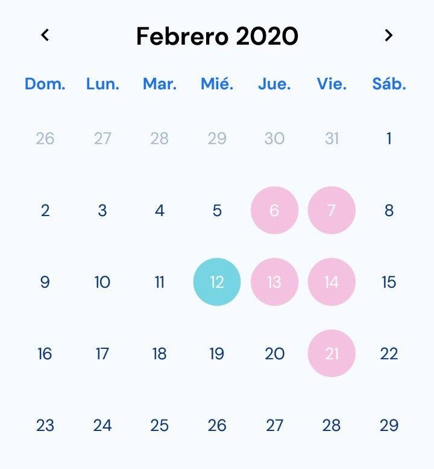

# react-native-calendar

React native simple and customizable calendar.


## Features

- Flexible style.
- Plain simple and flexible API
- Listeners for actions


## Setup

`npm install --save @kcodev/react-native-calendar`


## Usage

```javascript
import React, { Component } from 'react';
import { View } from 'react-native';
import Calendar from '@kcodev/react-native-calendar';

class App extends Component {
  render() {
    return (
      <View>
        <Calendar />
      </View>
    );
  }
}

export default App;
```


## Available props

| Name | Type| Default | Description |
| --- | --- | --- | --- |
| dateFormat | string | MMMM DD[,] YYYY | - Default date to show on calendar. |
| locale | string | es | - Locale of date on header. Use moment to manage dates, use locales soported by moment |
| minDate | any | null | - Minimum date to show on the calendar, the days before this, are disabled. |
| events | object | {} | - Events to display on calendar. More details on Documentation. |
| staticCalendar | bool | false | - Disable click of calendar days and make it static |
| weekDaysLabels | array | ['Dom.', 'Lun.', 'Mar.', 'Mié.', 'Jue.', 'Vie.', 'Sáb.'] | - Labels of days showed on Calendar Header |
| onPressDay | function | ()=>{} | - Callback when press on day. Return day and events if it exist. |
|eventsView  | element | null | - You can pass and element to render custom event indicator on calendar. More details in Documentation. |
| headerStyle | object | Object[Object] | - You can pass custom style to header. More details in Documentation. |
| dayStyle | object | Object[Object] | - You can pass custom style to day render. More details in Documentation. |


## Documentation
This component is a basic calendar component, it can be used to get a day selected and render events. 

##### Events

To render events, you need to pass a custom object. The required structure of object events is as follows.

```json
{
  "2020-01-24": [
    {
      "id": "1",
        "date": "2020-01-24",
        "color": "#654321"
    },
    {
      "id": "2",
        "date": "2020-01-24",
        "color": "#654541"
    }
  ],
  "2020-01-28": [
    {
      "id": "1",
        "date": "2020-01-28",
        "color": "#654321"
    }
  ]
}
```

The calendar highlights the day of the event using the color passed in the data object.


